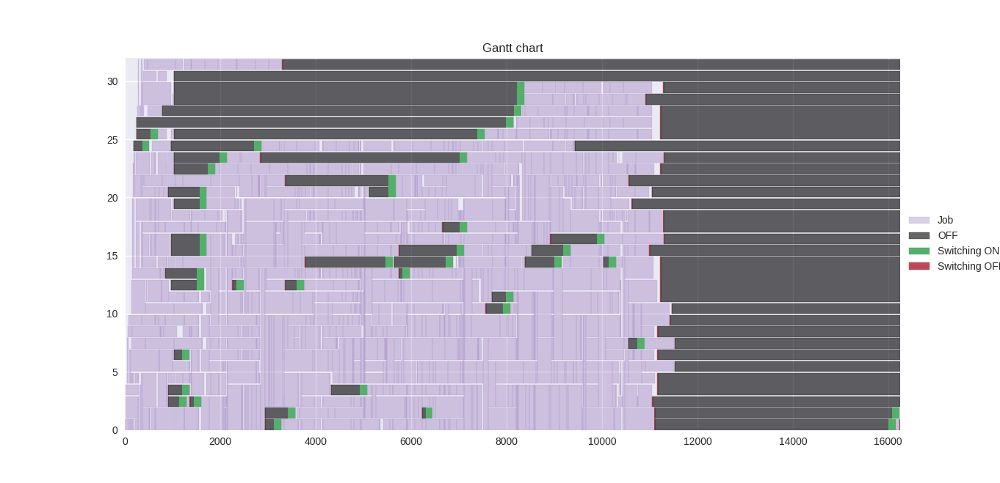
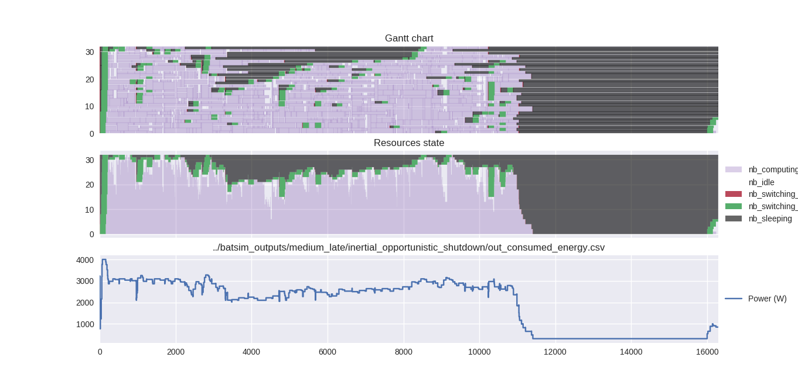
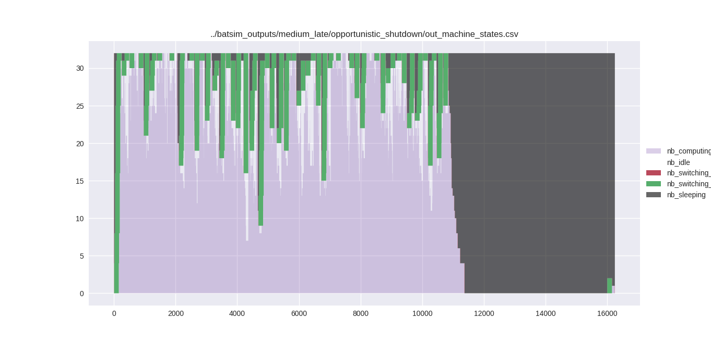

gantt_jobs_off.py
=================

### Example command

``` bash
odir=../batsim_outputs/medium_late/inertial_shutdown ; ./gantt_jobs_off.py \
  -j ${odir}/out_jobs.csv \
  -p ${odir}/out_pstate_changes.csv \
  --off 13 --switchon '-1' --switchoff '-2'
```

Example output
--------------



gantt_off_mstates.py
====================

### Example command

``` bash
odir=../batsim_outputs/medium_late/inertial_opportunistic_shutdown ; ./gantt_off_mstates.py \
  -j ${odir}/out_jobs.csv \
  -p ${odir}/out_pstate_changes.csv \
  -e ${odir}/out_consumed_energy.csv \
  -m ${odir}/out_machine_states.csv \
  --off 13 --switchon '-1' --switchoff '-2'
```

Example output
--------------



machine_states_over_time.py
===========================

### Example command
``` bash
odir=../batsim_outputs/medium_late/opportunistic_shutdown ; ./machine_states_over_time.py \
  ${odir}/out_machine_states.csv
```

Example output
--------------

