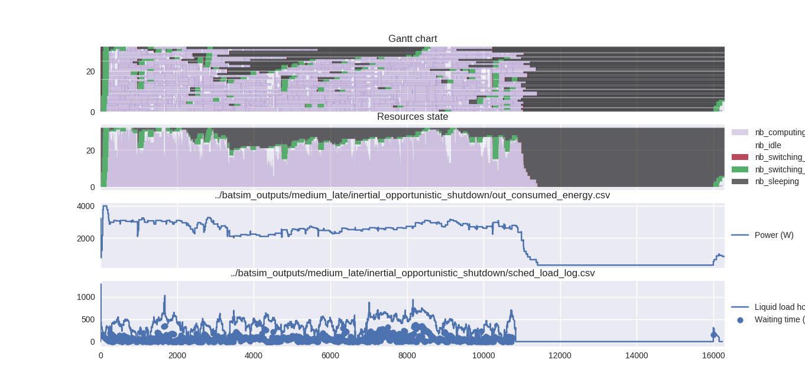
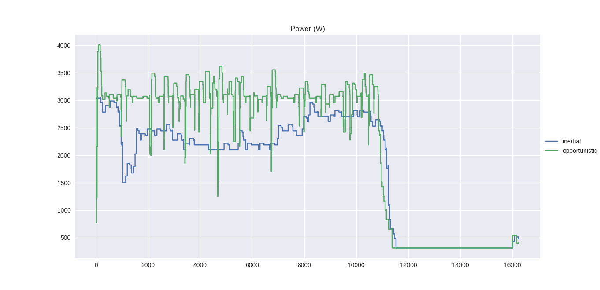
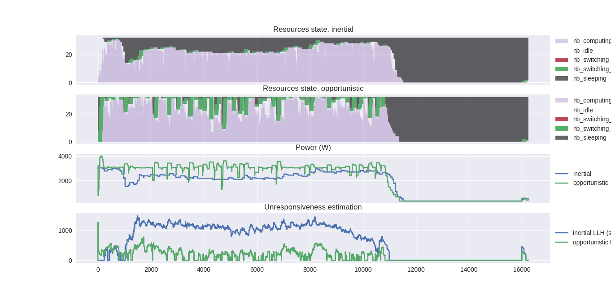

plot_energy_info.py
=================

This script allows to plot various energy information about a Batsim simulation.
It can notably used to generate:
  - Gantt charts with switched-off, switching-on and switching-off rectangles
  - An aggregated view of the resources over time (much faster)
  - A curve about the platform power consumption over time
  - A curve about the platform liquid load horizon (unresponsiveness estimator)
    over time

Gantt chart only
----------------

##### Example command

``` bash
odir=../batsim_outputs/medium_late/inertial_shutdown ; ./plot_energy_info.py \
  --gantt \
  -j ${odir}/out_jobs.csv \
  -p ${odir}/out_pstate_changes.csv \
  --off 13 --switchon '-1' --switchoff '-2'
```

##### Example output


Resource utilization only
-------------------------

##### Example command
``` bash
odir=../batsim_outputs/medium_late/opportunistic_shutdown ; ./plot_energy_info.py \
  --ru \
  -m ${odir}/out_machine_states.csv
```

##### Example output


Various energy-related plots
----------------------------

##### Example command

``` bash
odir=../batsim_outputs/medium_late/inertial_opportunistic_shutdown ; ./plot_energy_info.py \
  --gantt \
  -j ${odir}/out_jobs.csv \
  -p ${odir}/out_pstate_changes.csv \
  --off 13 --switchon '-1' --switchoff '-2' \
  --ru \
  -m ${odir}/out_machine_states.csv \
  -e ${odir}/out_consumed_energy.csv \
  -l ${odir}/sched_load_log.csv
```

##### Example output



Compare different schedules (power only)
----------------------------------------

##### Example command

``` bash
odir1=../batsim_outputs/medium_late/inertial_shutdown ; \
odir2=../batsim_outputs/medium_late/opportunistic_shutdown ; ./plot_energy_info.py \
  -e ${odir1}/out_consumed_energy.csv ${odir2}/out_consumed_energy.csv \
  --names 'inertial' 'opportunistic'
```

##### Example output


Compare different schedules (more complex)
--------------------------------------------------

##### Example command

``` bash
odir1=../batsim_outputs/medium_late/inertial_shutdown ; \
odir2=../batsim_outputs/medium_late/opportunistic_shutdown ; ./plot_energy_info.py \
  --ru \
  -m ${odir1}/out_machine_states.csv ${odir2}/out_machine_states.csv \
  -e ${odir1}/out_consumed_energy.csv ${odir2}/out_consumed_energy.csv \
  -l ${odir1}/sched_load_log.csv ${odir2}/sched_load_log.csv \
  --names 'inertial' 'opportunistic'
```

##### Example output

