Quick note
==========
Please do remark that the pdf images generated by asymptote are more beautiful
than those ugly rasterized png. The images have only been rasterized because
browsers struggle with pdf.

Jobs
====
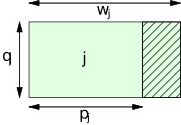
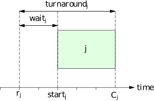

EASY Backfilling Animation
==========================
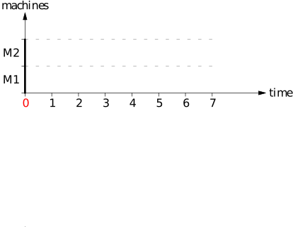
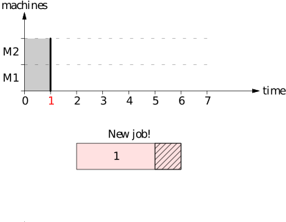
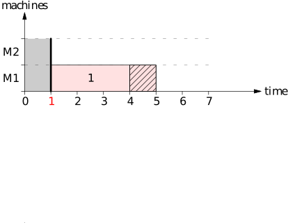
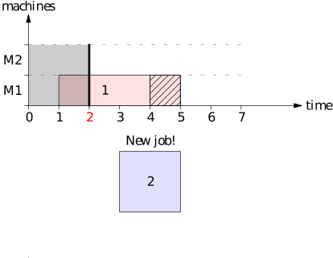
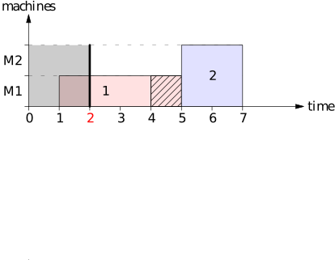
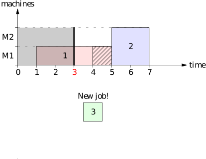
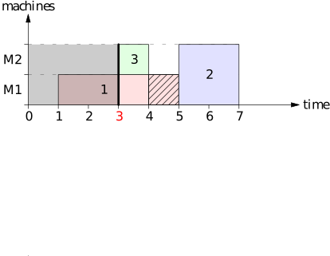
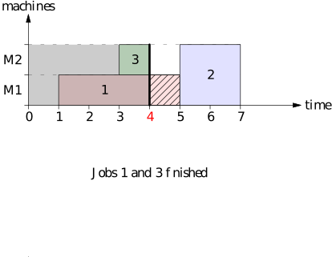

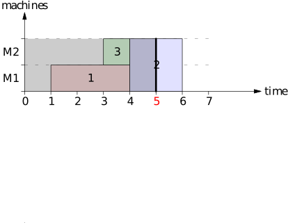
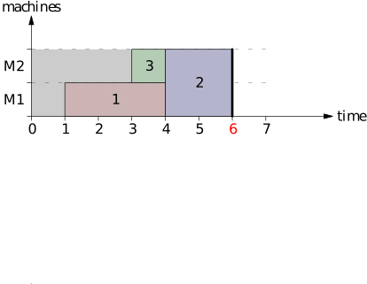

Energy Gantt Charts
===================
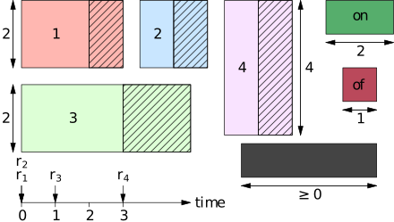
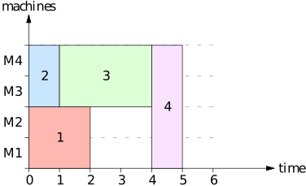
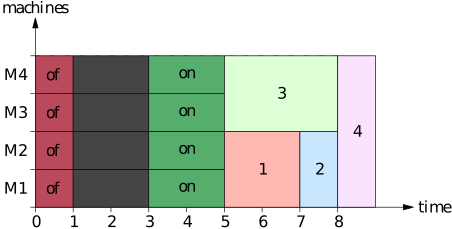
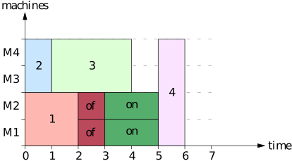

Liquid Load Horizon
===================
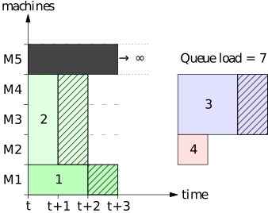
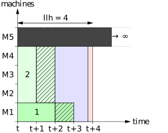
